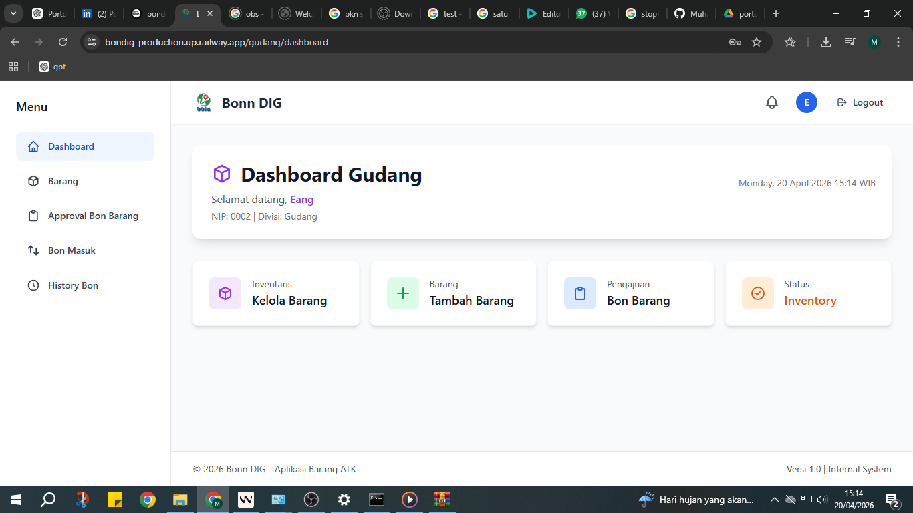
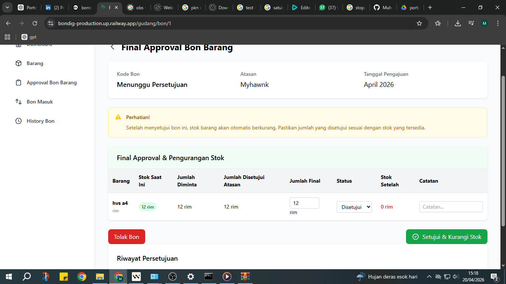
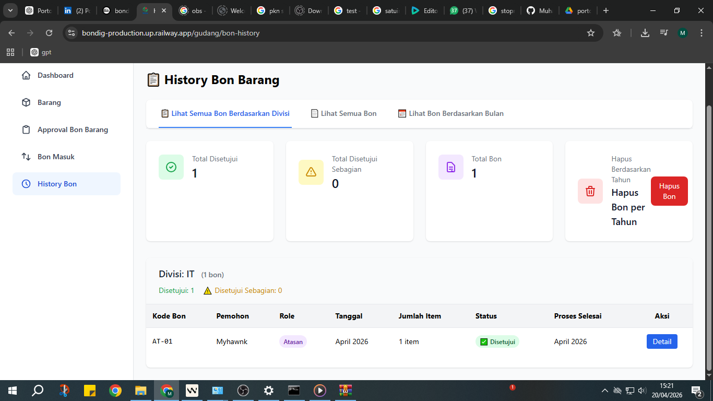

# Sistem Manajemen Bon Barang

Aplikasi web untuk mengelola permintaan barang di kantor/organisasi. Dari pengajuan pegawai sampai ke gudang, semuanya digital!


## Apa ini?

Ini adalah aplikasi yang saya buat untuk ngurusin permintaan barang di kantor. Jadi pegawai bisa minta barang lewat web, atasan approve, terus gudang yang proses. Semua digital, ga pake kertas lagi!

## Fitur Utama

### **Alur Kerja yang Simple**
- Pegawai ajukan permintaan barang (lebih praktis dari ngisi form)
- Atasan approve/reject (bisa dari HP)
- Gudang cek stok & kasih barang (otomatis kurangin stok)
- Admin bisa monitoring semua (buat laporan dll)

### **Akses Sesuai Peran**
- **Admin**: Ngurusin sistem, lihat data, buat laporan
- **Atasan**: Approve request, lihat progress timnya
- **Gudang**: Kelola stok, kasih barang ke pegawai
- **Pegawai**: Ajukan permintaan, liat statusnya

### **Ngurusin Stok Barang**
- Stok update otomatis (kalo ada yang keluar)
- Input data barang dengan kategori
- History semua transaksi (buat audit)
- Laporan stok kapan aja bisa diliat

### **Notifikasi Otomatis**
- Email kalo ada update status request
- Notifikasi di dashboard
- Semua yang terlibat tau statusnya

### **Laporan & Data**
- Laporan permintaan per bulan/tahun
- Statistik per departemen
- Export ke Excel (buat reporting ke bos)
- Dashboard yang gampang dimengerti

## Tech Stack yang Dipake

### **Backend**
- **Framework**: Laravel 12.0 (yang terbaru)
- **Language**: PHP 8.2+ (modern)
- **Database**: MySQL/MariaDB (reliable)
- **Authentication**: Laravel bawaan (sudah aman)

### **Frontend**
- **Template**: Blade (Laravel native)
- **CSS**: Bootstrap 5 (responsive & clean)
- **JavaScript**: Vanilla JS + jQuery (simple & effective)
- **Build Tool**: Vite (fast development)

### **Package Tambahan**
- `maatwebsite/excel` - Buat export ke Excel
- `mews/captcha` - Biar aman dari bot
- `ext-gd` - Buat gambar/captcha

## Cara Install

### **Yang Harus Disiapkan**
- PHP 8.2+ (yang penting)
- Composer (untuk PHP packages)
- MySQL/MariaDB (database)
- Node.js & NPM (buat frontend)

### **Langkah-langkahnya**
```bash
# Clone projectnya
git clone https://github.com/Muhammadawali1/bondig.git
cd bonn-dig-final-bos

# Install dependencies
composer install
npm install

# Setup environment
cp .env.example .env
php artisan key:generate
# Edit .env sesuai database kamu

# Database setup
php artisan migrate
php artisan db:seed

# Build frontend
npm run build

# Jalin aplikasi
php artisan serve
# Buka http://localhost:8000
```

## Database Structure

### **Table Utama**
- `users` - Data user (pegawai, admin, dll)
- `divisis` - Divisi/departemen
- `barangs` - Master data barang
- `bon_barangs` - Header permintaan barang
- `bon_barang_details` - Detail barang yang diminta
- `notifikasis` - Notifikasi sistem

## Screenshots

Berikut adalah tampilan aplikasi Sistem Manajemen Bon Barang:

### Dashboard Utama

*Dashboard untuk monitoring permintaan barang real-time*

### Form Pengajuan Barang

*Form pengajuan barang yang user-friendly dan intuitif*

### History & Tracking

*History permintaan barang dan tracking status*


## Cara Deploy

### **Untuk Production**
```bash
# Optimize biar cepat
composer install --optimize-autoloader --no-dev
php artisan config:cache
php artisan route:cache
php artisan view:cache

# Set environment
APP_ENV=production
APP_DEBUG=false
```

### **Cloud Deployment**
- Sudah ada config untuk Railway (nixpacks.toml)
- Bisa juga deploy ke Heroku, Vercel, dll
- Database bisa pake MySQL, PostgreSQL, atau SQLite

## Mau Kontribusi?

Boleh banget! Caranya:
1. Fork repository ini
2. Buat branch baru (`git checkout -b fitur-baru`)
3. Commit perubahan (`git commit -m 'Tambah fitur keren'`)
4. Push ke branch kamu (`git push origin fitur-baru`)
5. Buat Pull Request

Detailnya ada di [CONTRIBUTING.md](CONTRIBUTING.md)

## License

Project ini pake MIT License. Bebas dipake, dimodif, dll. Cek file [LICENSE](LICENSE) ya.

## Hubungi Saya

- **GitHub**: [Muhammadawali1](https://github.com/Muhammadawali1)
- **Email**: muhammadraihan9222@gmail.com
- **LinkedIn**: [LinkedIn Profile](https://www.linkedin.com/in/muhammad-awali-raihannul-labib-001b373b8/)

---

### Kenapa Laravel?

Saya pilih Laravel karena:
- Dokumentasi lengkap
- Community besar
- Fitur ORM yang powerful
- Security bawaan
- Mudah dipelajari

## About Laravel

Laravel is a web application framework with expressive, elegant syntax. We believe development must be an enjoyable and creative experience to be truly fulfilling. Laravel takes the pain out of development by easing common tasks used in many web projects, such as:

- [Simple, fast routing engine](https://laravel.com/docs/routing).
- [Powerful dependency injection container](https://laravel.com/docs/container).
- Multiple back-ends for [session](https://laravel.com/docs/session) and [cache](https://laravel.com/docs/cache) storage.
- Expressive, intuitive [database ORM](https://laravel.com/docs/eloquent).
- Database agnostic [schema migrations](https://laravel.com/docs/migrations).
- [Robust background job processing](https://laravel.com/docs/queues).
- [Real-time event broadcasting](https://laravel.com/docs/broadcasting).

Laravel is accessible, powerful, and provides tools required for large, robust applications.

## Learning Laravel

Laravel has the most extensive and thorough [documentation](https://laravel.com/docs) and video tutorial library of all modern web application frameworks, making it a breeze to get started with the framework.

You may also try the [Laravel Bootcamp](https://bootcamp.laravel.com), where you will be guided through building a modern Laravel application from scratch.

If you don't feel like reading, [Laracasts](https://laracasts.com) can help. Laracasts contains thousands of video tutorials on a range of topics including Laravel, modern PHP, unit testing, and JavaScript. Boost your skills by digging into our comprehensive video library.

## Laravel Sponsors

We would like to extend our thanks to the following sponsors for funding Laravel development. If you are interested in becoming a sponsor, please visit the [Laravel Partners program](https://partners.laravel.com).

### Premium Partners

- **[Vehikl](https://vehikl.com/)**
- **[Tighten Co.](https://tighten.co)**
- **[WebReinvent](https://webreinvent.com/)**
- **[Kirschbaum Development Group](https://kirschbaumdevelopment.com)**
- **[64 Robots](https://64robots.com)**
- **[Curotec](https://www.curotec.com/services/technologies/laravel/)**
- **[Cyber-Duck](https://cyber-duck.co.uk)**
- **[DevSquad](https://devsquad.com/hire-laravel-developers)**
- **[Jump24](https://jump24.co.uk)**
- **[Redberry](https://redberry.international/laravel/)**
- **[Active Logic](https://activelogic.com)**
- **[byte5](https://byte5.de)**
- **[OP.GG](https://op.gg)**

## Contributing

Thank you for considering contributing to the Laravel framework! The contribution guide can be found in the [Laravel documentation](https://laravel.com/docs/contributions).

## Code of Conduct

In order to ensure that the Laravel community is welcoming to all, please review and abide by the [Code of Conduct](https://laravel.com/docs/contributions#code-of-conduct).

## Security Vulnerabilities

If you discover a security vulnerability within Laravel, please send an e-mail to Taylor Otwell via [taylor@laravel.com](mailto:taylor@laravel.com). All security vulnerabilities will be promptly addressed.

## License

The Laravel framework is open-sourced software licensed under the [MIT license](https://opensource.org/licenses/MIT).
